# Database Reference

Source of truth: `config/db.php` (`initialize_schema()`).

## Summary
- Engine: SQLite
- Tables: 36
- FK mode: `PRAGMA foreign_keys = ON`
- Main domains:
  - Identity and user preferences
  - Projects, releases, bugs
  - Test plans/suites/cases/runs/executions
  - Wiki and versioning
  - Kanban boards/cards/comments
  - Integrations, activity, links, achievements

## ER Diagram (Mermaid)

```mermaid
erDiagram
  users ||--o| user_settings : has
  users ||--o{ user_availability : has
  users ||--o{ user_shortcuts : has
  users ||--o{ bugs : reports
  users ||--o{ bugs : assigns
  users ||--o{ bug_comments : writes
  users ||--o{ bug_history : changes
  users ||--o{ bug_mentions : mentioned
  users ||--o{ bug_watchers : watches
  users ||--o{ test_plans : creates
  users ||--o{ test_cases : creates
  users ||--o{ test_cases : updates
  users ||--o{ test_runs : creates
  users ||--o{ test_runs : assigned
  users ||--o{ test_executions : executes
  users ||--o{ wiki_pages : authors
  users ||--o{ wiki_pages : edits
  users ||--o{ wiki_history : edits
  users ||--o{ wiki_attachments : uploads
  users ||--o{ board_cards : assigned
  users ||--o{ card_comments : writes
  users ||--o{ card_attachments : uploads
  users ||--o{ attachments : uploads
  users ||--o{ activity_log : acts
  users ||--o{ saved_filters : saves
  users ||--o{ public_links : creates
  users ||--o{ notifications : receives
  users ||--o{ user_achievements : earns

  projects ||--o{ releases : has
  projects ||--o{ bugs : has
  projects ||--o{ bug_templates : has
  projects ||--o{ git_integrations : has
  projects ||--o{ test_plans : has
  projects ||--o{ testcase_templates : has
  projects ||--o{ wiki_pages : has
  projects ||--o{ boards : has
  projects ||--o{ webhooks : has

  releases ||--o{ bugs : targets
  releases ||--o{ test_plans : targets

  bugs ||--o{ bug_comments : has
  bugs ||--o{ bug_history : has
  bugs ||--o{ bug_mentions : has
  bugs ||--o{ bug_watchers : has
  bugs ||--o{ git_commits : linked
  bugs ||--o{ board_cards : linked
  bugs ||--o{ test_executions : linked
  bugs ||--o{ bug_similarity_cache : pair_left
  bugs ||--o{ bug_similarity_cache : pair_right
  bugs ||--o| bugs : duplicate_of

  bug_comments ||--o{ bug_comments : parent
  bug_comments ||--o{ bug_mentions : source

  test_plans ||--o{ test_suites : has
  test_plans ||--o{ test_runs : has
  test_suites ||--o{ test_suites : parent
  test_suites ||--o{ test_cases : has
  test_cases ||--o{ test_executions : executed
  test_cases ||--o{ git_commits : linked
  test_cases ||--o{ board_cards : linked
  test_runs ||--o{ test_executions : has

  wiki_pages ||--o{ wiki_pages : parent
  wiki_pages ||--o{ wiki_history : versions
  wiki_pages ||--o{ wiki_attachments : files
  wiki_pages ||--o{ board_cards : linked

  boards ||--o{ board_columns : has
  boards ||--o{ board_cards : has
  board_columns ||--o{ board_cards : contains
  board_cards ||--o{ card_comments : has
  board_cards ||--o{ card_attachments : has

  achievements ||--o{ user_achievements : assigned
```


## Table Catalog
### Identity and User Profile
- `users`
- `user_settings`
- `user_availability`
- `user_shortcuts`
- `notifications`

### Work Management
- `projects`
- `releases`
- `boards`
- `board_columns`
- `board_cards`
- `card_comments`
- `card_attachments`

### Bug Tracking
- `bugs`
- `bug_comments`
- `bug_history`
- `bug_mentions`
- `bug_watchers`
- `bug_templates`
- `bug_similarity_cache`

### Test Management
- `test_plans`
- `test_suites`
- `test_cases`
- `test_runs`
- `test_executions`
- `testcase_templates`

### Wiki
- `wiki_pages`
- `wiki_history`
- `wiki_attachments`

### Integrations and Platform
- `git_integrations`
- `git_commits`
- `attachments`
- `activity_log`
- `saved_filters`
- `webhooks`
- `public_links`
- `achievements`
- `user_achievements`

## Suggested Performance Indexes
```sql
CREATE INDEX IF NOT EXISTS idx_bugs_project_status ON bugs(project_id, status);
CREATE INDEX IF NOT EXISTS idx_bugs_priority_status ON bugs(priority, status);
CREATE INDEX IF NOT EXISTS idx_bugs_assignee_status ON bugs(assignee_id, status);
CREATE INDEX IF NOT EXISTS idx_bug_comments_bug_created ON bug_comments(bug_id, created_at);
CREATE INDEX IF NOT EXISTS idx_test_executions_run_status ON test_executions(test_run_id, status);
CREATE INDEX IF NOT EXISTS idx_test_cases_suite ON test_cases(suite_id);
CREATE INDEX IF NOT EXISTS idx_board_cards_column_order ON board_cards(column_id, order_index);
CREATE INDEX IF NOT EXISTS idx_wiki_pages_project_slug ON wiki_pages(project_id, slug);
```

