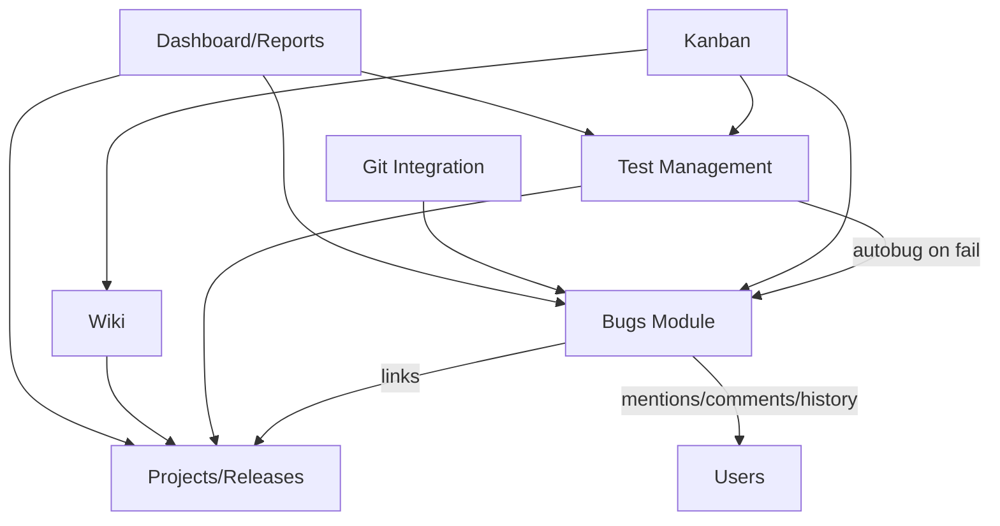
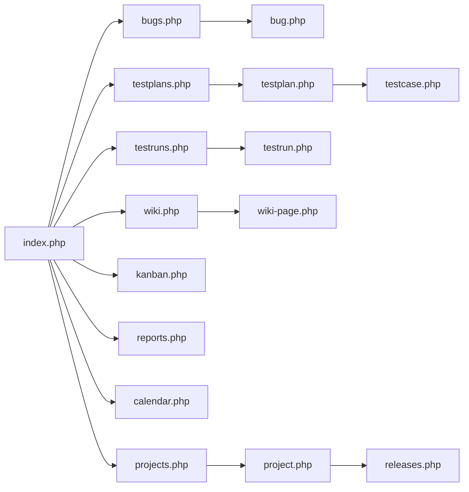
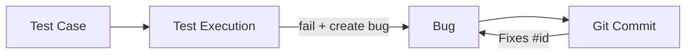

# Architecture

## System Overview
YJH is a modular monolith:
- Server-rendered PHP pages for core workflows.
- Lightweight JSON APIs under `/api/*` for async interactions.
- SQLite as a single-file transactional datastore.
- Shared includes (`includes/*.php`) for auth, layout, utilities, theme/language.

## High-Level Architecture
```mermaid
flowchart LR
    U[User Browser] --> P[PHP Pages]
    U --> A[AJAX /api/*]
    P --> I[includes/*]
    A --> I
    I --> DB[(SQLite database.sqlite)]
    A --> UP[uploads/]
    G[Git Provider Webhook] --> GH[/api/git-webhook.php]
    GH --> DB
```

## Module Interaction Map


## Navigation Map


## Traceability Flow


## Design Choices
- SQLite-first architecture for easy demo, local adoption, and portfolio portability.
- Procedural PHP pages reduce framework overhead for rapid feature iteration.
- API-first add-ons enable progressive enhancement without full SPA migration.
- Rich domain model in DB captures enterprise QA workflows.

## Risks and Next Evolution
- Current codebase is modular but not layer-separated by domain package.
- API lacks strict OpenAPI contract enforcement and automated tests.
- Next step: introduce service layer + repository abstraction + migrations.

