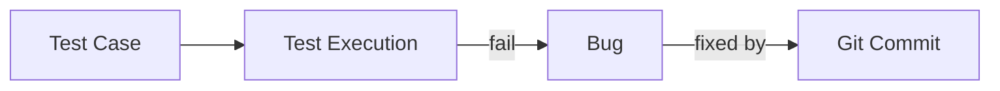

# Visualizations Pack

## 1) ER Diagram
Use: `docs/DATABASE.md` (`ER Diagram` section).

## 2) Architecture Diagram
Use: `docs/ARCHITECTURE.md` (`High-Level Architecture` section).

## 3) Test -> Bug -> Commit Relationship


## 4) Navigation Map
Use: `docs/ARCHITECTURE.md` (`Navigation Map`).

## 5) Risk Engine Formula
```text
Risk = ((blocker*5 + critical*3 + highPriority*2) / (totalBugs + 1)) * (1 - passRate)
```

## 6) Competitive Positioning
Use: `docs/COMPARISON.md`.

